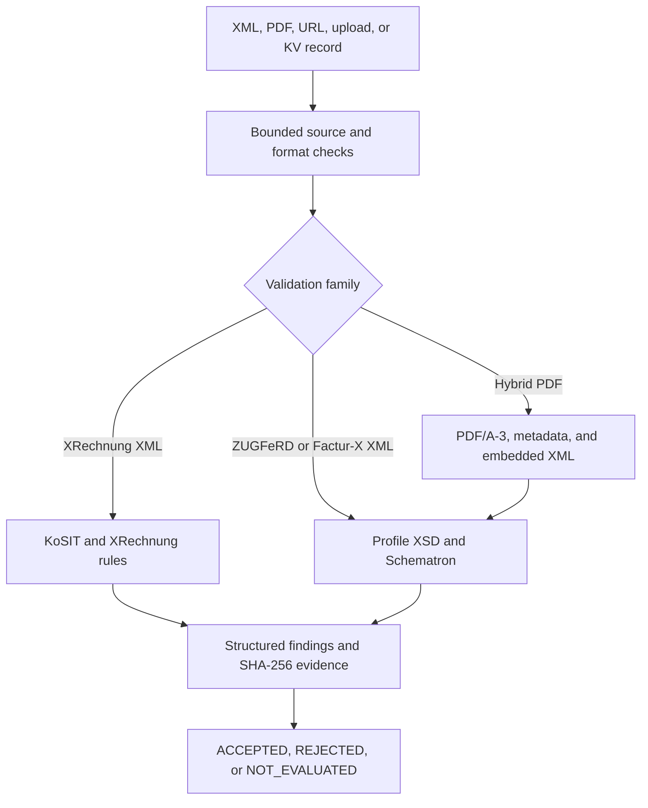

> **Live API:** [Run XRechnung & ZUGFeRD Invoice Validator API on Apify](https://apify.com/kamerozkan/xrechnung-xml-batch-validator-api)

# XRechnung & ZUGFeRD Invoice Validator API: Samples and JSON Schema

[](https://apify.com/kamerozkan/xrechnung-xml-batch-validator-api)


Validate XRechnung XML and ZUGFeRD or Factur-X XML/PDF invoices through one API. Each evaluated document returns a deterministic technical assessment, structured findings, SHA-256 evidence, and the exact pinned validation versions.

This repository contains three runnable inputs, three real output rows, and the row contract in [`dataset_record.schema.json`](dataset_record.schema.json).

> **Decision boundary:** `ACCEPTED` means every required pinned technical validation layer accepted the submitted document. It is not legal, tax, accounting, authenticity, delivery, payment, or recipient acceptance evidence.

## Start here

1. Open the [Actor on Apify](https://apify.com/kamerozkan/xrechnung-xml-batch-validator-api).
2. Copy one of the three input files below.
3. Run the public fixtures first, then replace the document source with your own HTTPS URL, upload, inline XML, base64 value, or Apify key-value store record.
4. Keep optional raw reports off for real invoices unless your retention and access controls are ready.

At the 2026-07-30 portfolio audit, the Actor was public and latest build `0.0.16` had completed successfully. The output rows below came from successful run `R9gep9fAWMbrVA96h` on build `0.0.9`, which produced five records. The fixture SHA-256 values were independently matched to the committed source URLs. See [`DATA_NOTICE.md`](DATA_NOTICE.md) for the exact version and provenance boundary.

## What is checked

| Input | Required checks |
|---|---|
| XRechnung XML | KoSIT Validator `1.6.0` with XRechnung configuration `v2026-01-31` |
| ZUGFeRD or Factur-X CII XML | Exact profile allowlist, ZUGFeRD `2.5` XSD, and profile Schematron |
| ZUGFeRD or Factur-X PDF | PDF/A-3 checks, safe embedded XML extraction, metadata and attachment consistency, then complete CII XML checks |

PDF/A compliance alone is never treated as a valid invoice.

## Input examples

<details>
<summary><strong>01. Accepted official XRechnung UBL fixture</strong> - public Store example source</summary>

[`01_public_kosit_xrechnung_input.json`](01_public_kosit_xrechnung_input.json)

```json
{
  "documents": [
    {
      "documentId": "xrechnung-valid",
      "fileName": "valid-xrechnung.xml",
      "url": "https://raw.githubusercontent.com/itplr-kosit/xrechnung-testsuite/v2026-01-31/src/test/business-cases/standard/01.01a-INVOICE_ubl.xml"
    }
  ],
  "resultDetail": "FINDINGS",
  "maxFindingsPerDocument": 100,
  "storeXmlReport": true,
  "storeHtmlReport": true,
  "storePdfaReport": false,
  "storeExtractedInvoiceXml": false
}
```

The downloaded fixture is 6,742 bytes and has SHA-256 `3558d8eee6499350f69c150b54b4019556458667cfc972beaa9bb7bf1e11303f`.

</details>

<details>
<summary><strong>02. Rejected official XRechnung UBL fixture</strong> - structured business-rule evidence</summary>

[`02_verified_xrechnung_rejected_input.json`](02_verified_xrechnung_rejected_input.json)

```json
{
  "documents": [
    {
      "documentId": "xrechnung-invalid",
      "fileName": "invalid-xrechnung.xml",
      "url": "https://raw.githubusercontent.com/itplr-kosit/validator-configuration-xrechnung/v2026-01-31/src/test/integration/ubl-cr-646-sub-invoice-lines-cius.xml"
    }
  ],
  "resultDetail": "FINDINGS",
  "maxFindingsPerDocument": 100,
  "storeXmlReport": true,
  "storeHtmlReport": true,
  "storePdfaReport": false,
  "storeExtractedInvoiceXml": false
}
```

The downloaded fixture is 15,078 bytes and has SHA-256 `7455ce3d58b5869a76abd4d0187f8f10a7c1462ecb6ce32bfe07044e61f57e10`.

</details>

<details>
<summary><strong>03. Rejected ZUGFeRD PDF/A fixture</strong> - hybrid-container failure evidence</summary>

[`03_verified_zugferd_pdfa_rejection_input.json`](03_verified_zugferd_pdfa_rejection_input.json)

```json
{
  "documents": [
    {
      "documentId": "zugferd-invalid-pdfa",
      "fileName": "invalidPDF.pdf",
      "url": "https://raw.githubusercontent.com/ZUGFeRD/mustangproject/87380b8e58624df9efdd9c568f6500d53709c165/validator/src/test/resources/invalidPDF.pdf"
    }
  ],
  "resultDetail": "FINDINGS",
  "maxFindingsPerDocument": 100,
  "storeXmlReport": true,
  "storeHtmlReport": true,
  "storePdfaReport": true,
  "storeExtractedInvoiceXml": true
}
```

The commit-pinned fixture is 1,500,988 bytes and has SHA-256 `30b44b5ba1a0b38b8871c9bde2154bb3bdebc7b4a6f43d4579a5d46bf5634957`.

This public test recipe enables raw reports and extracted invoice XML to demonstrate all artifact keys. Keep those options off for real invoices unless you intend to retain the full invoice data.

</details>

## Live output examples

All three records below are verbatim output rows or verbatim field subsets from the same successful Actor run. No omitted value was reconstructed.

<details>
<summary><strong>01. ACCEPTED XRechnung</strong> - KoSIT evaluation completed with no fatal, error, or warning finding</summary>

[`01_live_xrechnung_accepted_output.json`](01_live_xrechnung_accepted_output.json)

```json
{
  "inputIndex": 0,
  "documentId": "xrechnung-valid",
  "fileName": "valid-xrechnung.xml",
  "processingStatus": "SUCCEEDED",
  "conformanceStatus": "ACCEPTED",
  "sourceFormat": "XML",
  "validationFamily": "XRECHNUNG",
  "syntax": "UBL_INVOICE",
  "profile": "XRECHNUNG_CIUS",
  "scenario": "EN16931 XRechnung (UBL Invoice)",
  "versions": {
    "validator": "1.6.0",
    "configurationRelease": "2026-01-31",
    "xrechnung": "3.0.2",
    "cenSchematron": "1.3.15",
    "mustang": "2.24.0",
    "veraPdf": "1.30.2",
    "zugferdRules": "2.5",
    "facturXRules": "1.09"
  },
  "counts": {
    "fatal": 0,
    "error": 0,
    "warning": 0,
    "information": 1
  },
  "findings": [
    {
      "severity": "INFORMATION",
      "ruleId": "BR-DE-TMP-32",
      "message": "[BR-DE-TMP-32] Eine Rechnung sollte zur Angabe des Liefer-/Leistungsdatums entweder BT-72 \"Actual delivery date\", BG-14 \"Invoicing period\" oder in jeder Rechnungsposition BG-26 \"Invoice line period\" enthalten.",
      "location": "/Q{urn:oasis:names:specification:ubl:schema:xsd:Invoice-2}Invoice[1]"
    }
  ],
  "findingsTruncated": false,
  "sha256": "3558d8eee6499350f69c150b54b4019556458667cfc972beaa9bb7bf1e11303f",
  "embeddedXmlSha256": null,
  "container": null,
  "checkedAt": "2026-07-29T05:53:18.155637Z",
  "reports": {
    "validationXmlKey": "VALIDATION-REPORT-0001-xrechnung-valid.xml",
    "htmlKey": "VALIDATION-REPORT-0001-xrechnung-valid.html"
  },
  "error": null
}
```

</details>

<details>
<summary><strong>02. REJECTED XRechnung</strong> - structured rule ID, message, and location</summary>

[`02_live_xrechnung_rejected_output.json`](02_live_xrechnung_rejected_output.json)

```json
{
  "inputIndex": 1,
  "documentId": "xrechnung-invalid",
  "fileName": "invalid-xrechnung.xml",
  "processingStatus": "SUCCEEDED",
  "conformanceStatus": "REJECTED",
  "sourceFormat": "XML",
  "validationFamily": "XRECHNUNG",
  "syntax": "UBL_INVOICE",
  "profile": "XRECHNUNG_CIUS",
  "scenario": "EN16931 XRechnung (UBL Invoice)",
  "versions": {
    "validator": "1.6.0",
    "configurationRelease": "2026-01-31",
    "xrechnung": "3.0.2",
    "cenSchematron": "1.3.15",
    "mustang": "2.24.0",
    "veraPdf": "1.30.2",
    "zugferdRules": "2.5",
    "facturXRules": "1.09"
  },
  "counts": {
    "fatal": 0,
    "error": 1,
    "warning": 0,
    "information": 0
  },
  "findings": [
    {
      "severity": "ERROR",
      "ruleId": "UBL-CR-646",
      "message": "[UBL-CR-646]-A UBL invoice should not include the InvoiceLine SubInvoiceLine",
      "location": "/Q{urn:oasis:names:specification:ubl:schema:xsd:Invoice-2}Invoice[1]",
      "originalSeverity": "WARNING"
    }
  ],
  "findingsTruncated": false,
  "sha256": "7455ce3d58b5869a76abd4d0187f8f10a7c1462ecb6ce32bfe07044e61f57e10",
  "embeddedXmlSha256": null,
  "container": null,
  "checkedAt": "2026-07-29T05:53:18.685160Z",
  "reports": {
    "validationXmlKey": "VALIDATION-REPORT-0002-xrechnung-invalid.xml",
    "htmlKey": "VALIDATION-REPORT-0002-xrechnung-invalid.html"
  },
  "error": null
}
```

</details>

<details>
<summary><strong>03. REJECTED ZUGFeRD PDF</strong> - PDF/A-3 container failed while embedded XML evidence remained explicit</summary>

[`03_live_zugferd_pdfa_rejected_output.json`](03_live_zugferd_pdfa_rejected_output.json)

```json
{
  "inputIndex": 4,
  "documentId": "zugferd-invalid-pdfa",
  "fileName": "invalidPDF.pdf",
  "processingStatus": "SUCCEEDED",
  "conformanceStatus": "REJECTED",
  "sourceFormat": "ZUGFERD_PDF",
  "validationFamily": "ZUGFERD",
  "syntax": "CII_INVOICE",
  "profile": "ZUGFERD_EN16931",
  "scenario": "ZUGFeRD 2.5 / Factur-X 1.09 EN16931",
  "counts": {
    "fatal": 0,
    "error": 1,
    "warning": 3,
    "information": 0
  },
  "findings": [
    {
      "severity": "ERROR",
      "stage": "PDF_A",
      "ruleId": "ISO 19005-3:2012 6.2.4.3-2",
      "failedChecks": 5
    }
  ],
  "findingsTruncated": false,
  "sha256": "30b44b5ba1a0b38b8871c9bde2154bb3bdebc7b4a6f43d4579a5d46bf5634957",
  "embeddedXmlSha256": "5203ba77a991466a7fc65f144abbf3eb8b45082686ef9c10aa07c79513e73ada",
  "container": {
    "type": "PDF_A_3",
    "pdfaStatus": "NON_COMPLIANT",
    "pdfaProfile": "PDF/A-3u validation profile",
    "metadataStatus": "CONSISTENT",
    "embeddedFileName": "factur-x.xml",
    "embeddedFileBytes": 10248,
    "afRelationship": "Alternative",
    "mimeType": "text/xml",
    "visibleContentConsistency": "NOT_VERIFIED",
    "signatureStatus": "NOT_CHECKED"
  },
  "checkedAt": "2026-07-29T05:54:18.578934Z",
  "reports": {
    "validationXmlKey": "VALIDATION-REPORT-0005-zugferd-invalid-pdfa.xml",
    "htmlKey": "VALIDATION-REPORT-0005-zugferd-invalid-pdfa.html",
    "pdfaXmlKey": "VALIDATION-REPORT-0005-zugferd-invalid-pdfa.pdfa.xml",
    "extractedInvoiceXmlKey": "VALIDATION-REPORT-0005-zugferd-invalid-pdfa.invoice.xml"
  },
  "error": null
}
```

</details>

## Result contract

| Processing | Conformance | Meaning | Validation event |
|---|---|---|---|
| `SUCCEEDED` | `ACCEPTED` | Every required pinned technical layer passed | Charged |
| `SUCCEEDED` | `REJECTED` | The document was evaluated and one or more required rules failed | Charged |
| `FAILED` | `NOT_EVALUATED` | A source, format, engine, timeout, report, or budget failure prevented a decision | Not charged |

At the audit snapshot, the `invoice-validated` event cost was `$0.004` per evaluated invoice. Check the [current Actor pricing](https://apify.com/kamerozkan/xrechnung-xml-batch-validator-api) before production use.

## Processing architecture



## Validate the sample rows

The schema uses JSON Schema draft 2020-12:

```bash
npx ajv-cli@5 validate \
  --strict=false \
  --spec=draft2020 \
  -s dataset_record.schema.json \
  -d '*_output.json'
```

## Run through the Apify API

Set `APIFY_TOKEN` in your shell, then send any sample input:

```bash
curl -X POST \
  "https://api.apify.com/v2/acts/kamerozkan~xrechnung-xml-batch-validator-api/run-sync-get-dataset-items?token=${APIFY_TOKEN}" \
  -H "Content-Type: application/json" \
  --data-binary @01_public_kosit_xrechnung_input.json
```

The Actor is also discoverable and runnable by AI agents through Apify's MCP server at `mcp.apify.com`.

## Security and interpretation

- Validation runs inside the Actor container. The documented pipeline does not send invoices to a third-party validation API.
- Raw invoice content is not copied to the dataset or logs.
- Optional reports and extracted XML can contain complete invoice data and follow the customer's Apify retention settings.
- Findings can quote an offending invoice value. Treat production results as sensitive.
- Public fixture links, standards, and validator dependencies remain subject to their own licenses and terms.
- The Actor is an independent tool and is not affiliated with or endorsed by KoSIT, FeRD, FNFE-MPE, veraPDF, or any invoice recipient.
- Source access, standards, rule releases, platform pricing, and recipient requirements can change.

## License

The original documentation, sample projections, and JSON Schema in this repository are available under the [MIT License](LICENSE). Third-party fixtures, standards, trademarks, validation engines, and source material are excluded from that license.

## E-Invoice Automation Suite

This repository is part of a 16-product invoice automation family. Public Actor links are runnable Store listings. Private labels are release-state disclosures, not public availability claims.

- Public validators: [`xrechnung-xml-batch-validator-api`](https://apify.com/kamerozkan/xrechnung-xml-batch-validator-api) ([`xrechnung-xml-batch-validator-api-sample`](https://github.com/kamerozkan/xrechnung-xml-batch-validator-api-sample)), [`france-einvoice-validator`](https://apify.com/kamerozkan/france-einvoice-validator) ([`france-einvoice-validator-sample`](https://github.com/kamerozkan/france-einvoice-validator-sample)), [`italy-fatturapa-validator`](https://apify.com/kamerozkan/italy-fatturapa-validator) ([`italy-fatturapa-validator-sample`](https://github.com/kamerozkan/italy-fatturapa-validator-sample)), [`peppol-bis-preflight-validator`](https://apify.com/kamerozkan/peppol-bis-preflight-validator) ([`peppol-bis-preflight-validator-sample`](https://github.com/kamerozkan/peppol-bis-preflight-validator-sample)), and [`poland-ksef-preflight-validator`](https://apify.com/kamerozkan/poland-ksef-preflight-validator) ([`poland-ksef-preflight-validator-sample`](https://github.com/kamerozkan/poland-ksef-preflight-validator-sample)).
- Private validator preview: `romania-efactura-validator` ([`romania-efactura-validator-sample`](https://github.com/kamerozkan/romania-efactura-validator-sample)), private release preview with a successful hosted build.
- Private generators with successful hosted builds: `xrechnung-invoice-generator` ([`xrechnung-invoice-generator-sample`](https://github.com/kamerozkan/xrechnung-invoice-generator-sample)), `peppol-ubl-invoice-generator` ([`peppol-ubl-invoice-generator-sample`](https://github.com/kamerozkan/peppol-ubl-invoice-generator-sample)), `zugferd-facturx-pdf-generator` ([`zugferd-facturx-pdf-generator-sample`](https://github.com/kamerozkan/zugferd-facturx-pdf-generator-sample)), `fatturapa-invoice-generator` ([`fatturapa-invoice-generator-sample`](https://github.com/kamerozkan/fatturapa-invoice-generator-sample)), and `ksef-fa-invoice-generator` ([`ksef-fa-invoice-generator-sample`](https://github.com/kamerozkan/ksef-fa-invoice-generator-sample)).
- Parsers and converters: public [`zugferd-facturx-pdf-to-json`](https://apify.com/kamerozkan/zugferd-facturx-pdf-to-json) ([`zugferd-facturx-pdf-to-json-sample`](https://github.com/kamerozkan/zugferd-facturx-pdf-to-json-sample)); private release-ready `xrechnung-to-json-parser` ([`xrechnung-to-json-parser-sample`](https://github.com/kamerozkan/xrechnung-to-json-parser-sample)); private hosted-build-ready `peppol-ubl-to-json-parser` ([`peppol-ubl-to-json-parser-sample`](https://github.com/kamerozkan/peppol-ubl-to-json-parser-sample)), `zugferd-to-xrechnung-converter` ([`zugferd-to-xrechnung-converter-sample`](https://github.com/kamerozkan/zugferd-to-xrechnung-converter-sample)), and `ubl-cii-format-converter` ([`ubl-cii-format-converter-sample`](https://github.com/kamerozkan/ubl-cii-format-converter-sample)).
